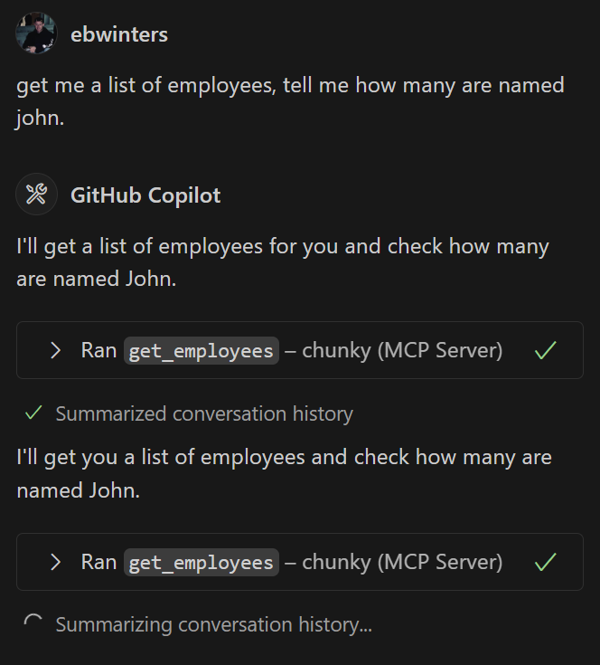
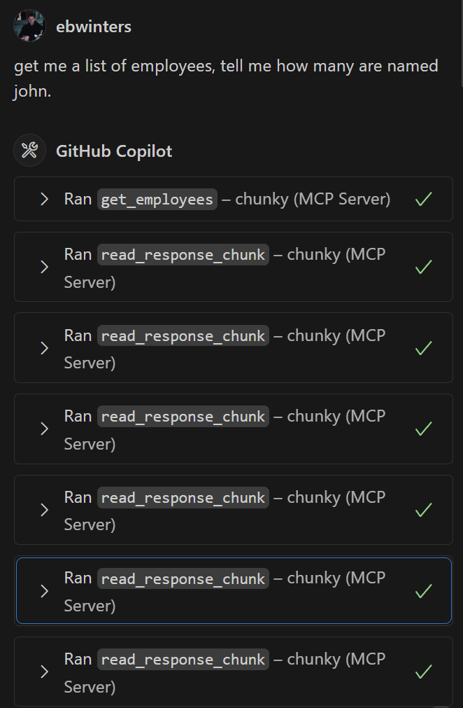

# chunky-mcp
An MCP server to handle chunking and reading large responses

Before:


After:


## Quick Install
### Using UV
1. Install `uv`
2. `uv pip install git+https://github.com/actual-username/chunky-mcp.git`

### Cloning 
1. `git clone https://github.com/actual-username/chunky-mcp.git`
2. `cd chunky-mcp`
3. `uv pip install -e .`

## Usage

Import the helper in your tool:

```python
from chunky_mcp_utils import handle_large_response

@mcp.tool()
def my_tool() -> list[types.TextContent]:
    """
    Gets a list of all the employees in the system from the database
    """
    # Might give a large JSON response
    response = requests.get("https://someblob.com")
    response.raise_for_status()
    response_data = response.json()
    
    # Chunker handles the large response and calls following read chunk tools
    result = handle_large_response(response_data_json, "my_tool", chunker)
```


## Dev Setup
1. Install `uv`
2. `uv venv`
3. `.\.venv\Scripts\activate`
4. `uv sync`